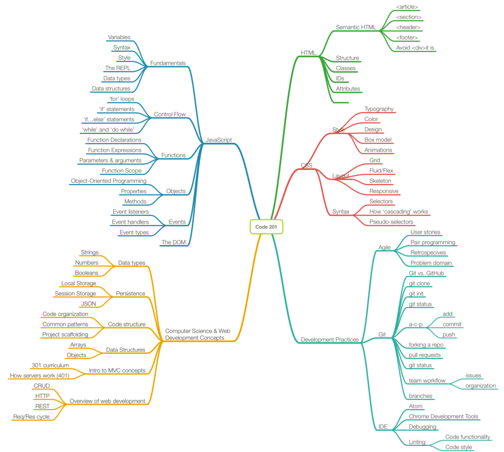
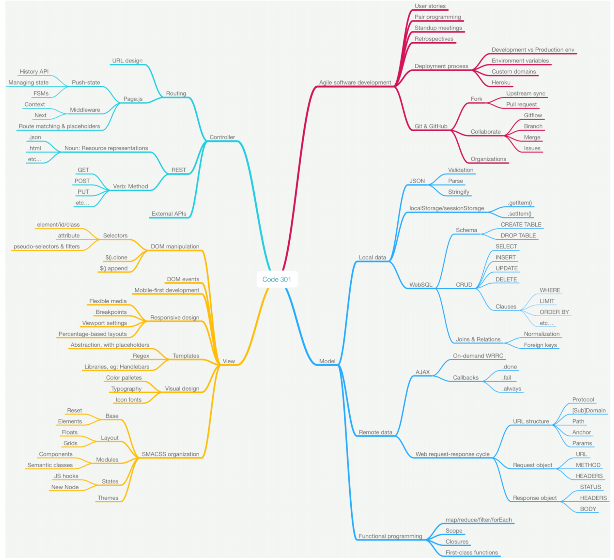

## **Working with Libraries**
# Class 15: Looking to the Future: Code 301 Preview and Project Week

[Schedule](#schedule) | [Announcements](#announcements) | [Objectives](#learning-objectives) | [Notes](#notes) | [Readings](#readings)

### Schedule
1. No class (:

### Announcements
* Due Sunday night:
    * 301 Entrance Exam 
    * Finalized and deployed bus mall lab

### ALL the learning objectives
Even if it doesn't feel like you've learned a lot, these are all the learning objectives we've covered in the past 3 weeks:
[ALL the learning objectives](learning-objectives.md)

### Mind Maps
Topics we've covered in 201

Topics we'll cover in 301
